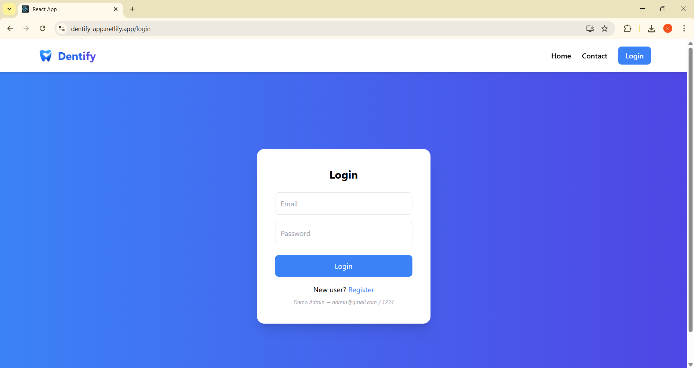
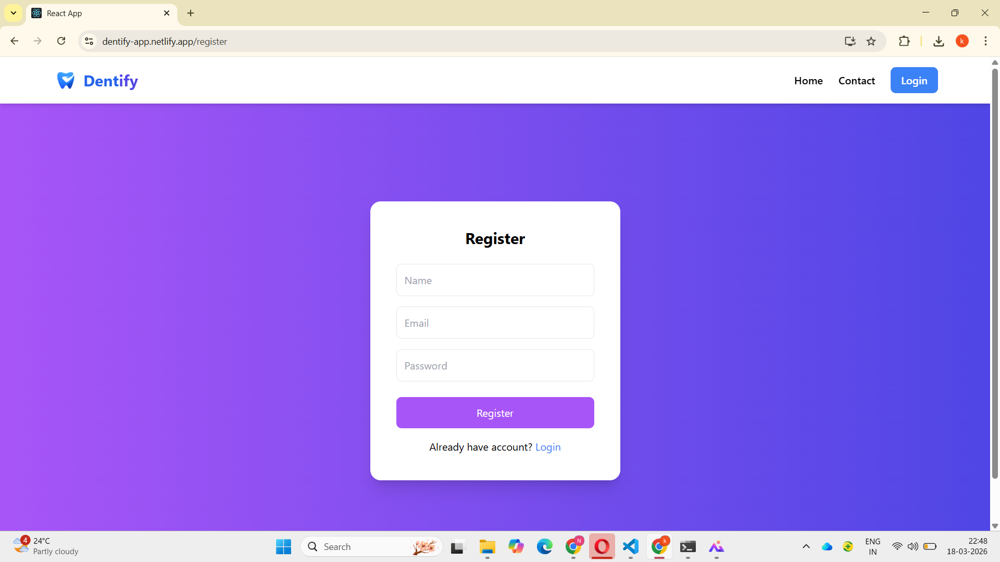
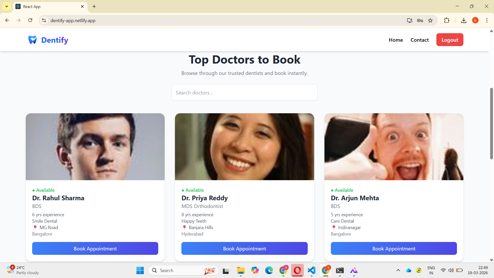
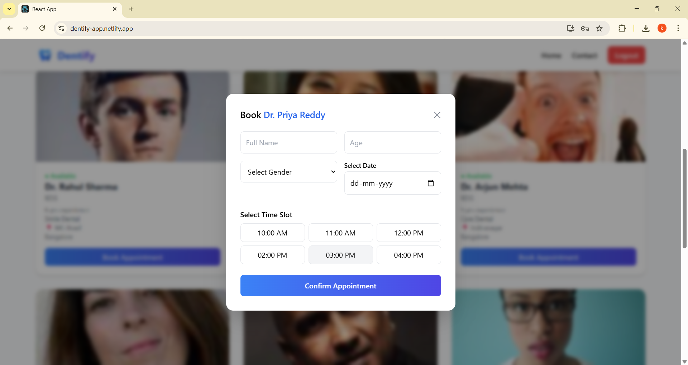
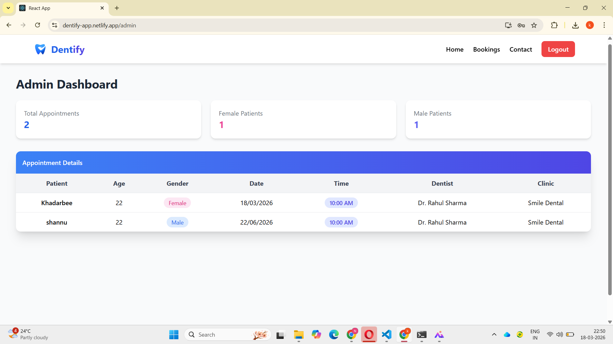

# 🦷 Dentist Appointment Booking Platform

---

## 📌 Description

Dentify is a full-stack MERN application that enables users to discover dentists, book appointments seamlessly, and manage bookings through dedicated dashboards for users, doctors, and admins.

---
## 📌 Features

### 👤 User Features
- Browse dentists with detailed profiles
- Search & filter dentists
- Book appointments with:
  - Name, Age, Gender
  - Date & Time Slot selection
- View personal bookings (My Appointments)
- Smooth animations and modern UI experience

---

### 🔐 Authentication
- Secure Login & Registration
- JWT Token-based authentication
- Protected routes
- Role-based redirection

---

### 🧑‍⚕️ Doctor Features
- View assigned appointments

### 🛠️ Admin Features
* Secure admin login
* View all appointments (patient name, age, gender, appointment date, dentist name, clinic name, slot)

---

## ✨ Key Highlights
- 🔐 JWT-based Authentication & Authorization
- 👥 Role-Based Access (User / Admin / Doctor)
- 📅 Smart Appointment Booking System
- ⚡ Modern UI with Tailwind + Animations (Framer Motion)
- 📱 Fully Responsive (Mobile + Desktop)
- 🔎 Search & Filtering for Dentists
- 📊 Admin Dashboard for Booking Management
- 🧑‍⚕️ Doctor Dashboard for appointment tracking

---

## 📸 Screenshots

### 🏠 Home Page

## 📄 Pages & UI Preview

### 🏠 Home Page

### 🔐 Login Page

### 📝 Register Page

### 🧑‍⚕️ Doctors Listing

### 📅 Booking Page

### 🛠️ Admin Dashboard

## 🧰 Tech Stack

### Frontend

* React.js
* Tailwind CSS
* React Router DOM
* Fetch API

### Backend

* Node.js
* Express.js
* MongoDB (Mongoose)
* JWT Authentication
* RESTful API

## 📡 API Endpoints

### Auth
POST /api/auth/register  
POST /api/auth/login  

### Appointments
POST /api/appointments  
GET /api/appointments  
GET /api/appointments/my  
GET /api/appointments/doctor  

### Dentists
GET /api/dentists  

## ⚙️ Installation & Setup

### 🔐 Environment Variables

Create a `.env` file in backend and add:

MONGO_URI=your_mongodb_connection
JWT_SECRET=your_secret_key
PORT=5000

### Clone Repository

git clone https://github.com/Khadarbeesk/dentist-app.git

### Backend Setup

cd backend
npm install
node server.js

### Frontend Setup

cd frontend
npm install
npm start

---

## 🔒 Security

* Passwords are securely hashed
* JWT tokens used for authentication
* Protected routes for admin access

---

## 🔑 Demo Credentials

**Admin Login**
Email: [admin@gmail.com](mailto:admin@gmail.com)
Password: 1234

---

## ⚠️ Important Note

Admin credentials are pre-defined for demo purposes.
Users cannot self-register as admin.

---

## 🚀 Future Improvements

* Payment integration
* Email/SMS notifications
* Appointment cancellation & rescheduling
* Doctor availability calendar

---

## 👨‍💻 Author

**Khadarbee Shaik**
